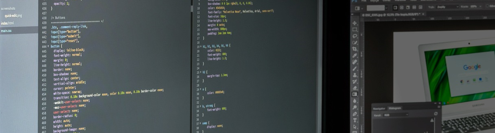

<!-- Title & description -->
## About me

Hello, world. I am Rosa Nunez, an IT professional and student of Software Development at Manitoba Institute of Trades & Technologies based in Winnipeg, Manitoba, Canada. With a background in hospital administration and system management, I bring a unique blend of expertise to the world of software development. My passion is using technology to enhance business applications and simplify processes, ultimately contributing to organizational success.

## Goal 

My goal is to use my experience in Software development and Enterprise Resource Planning (ERP) Implementation to deliver innovative solutions that drive efficiency and productivity. I'm dedicated to ensuring that my work brings real value to every project or organization I'm a part of.

## Experience
### Hospital Del Valle, San Pedro Sula, Honduras
**Administrative Director**  
Jul 2005 - Jul 2023  
- Led daily operations and fostered teamwork across multiple departments
- Oversaw the implementation of 80% of the hospital's Enterprise Resource Planning system
- Ensured alignment with annual operational plans to meet departmental goals

**System Administrator**  
Mar 1998 - Jun 2005  
- Provided training and support on the administrative system to staff
- Managed hospital systems and conducted monthly closings
- Prepared reports on hospital operations for management decision-making purposes

## Education

**Diploma of Education Software Development**  
Manitoba Institute of Trades and Technology, Winnipeg, Manitoba, Canada  
2023 - 2024

**Computer Engineer in Computer Science**  
Universidad Tecnológica de Honduras, Honduras  
1999 - 2008

## Skills

### Software Development 

  &nbsp;
  &nbsp;
  &nbsp;
  &nbsp;
  
  &nbsp;

### Others skills
- Enterprise Resource Planning (ERP) Implementation
- System Administration
- Process Improvement
- Team working and Collaboration
- Report Generation and Analysis
- Training and User Support

##
### Contributions
  

<!-- Footer -->

